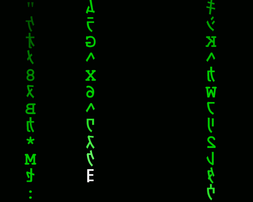

<h2> こんにちは(^_^) Welcome to my GitHub! 💻🤗</h2>

<ul>
    <li> 🔭 I’m currently working on some personal projects
    <li> 🌱 I’m currently learning JavaScript, HTML-5 and CSS
    <li> 🔎 I'm currently searching for a Front-end job
    <li> 🐧 I use linux and love customizing my OS
    <li> 📫 How to reach me: diogogarbinato@gmail.com
    <li> ⚡ Fun fact: I've lived in 3 different countries :) 
</ul>

<h2>Languages & Tools:</h2>

 

